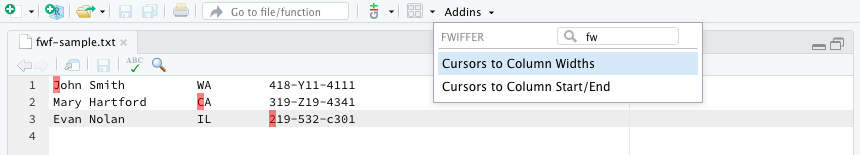

<!-- badges: start -->
<!-- badges: end -->


<center><h1>&#x2728; fwiffer &#x2728;</h1></center>

Getting column positions and widths for parsing fixed width file formats is painful. Tape measures are dangerous and useless for measuring columns widths. If your data is stored in fixed width files but `readr::read_fwf()` can't guess the column widths, then you need a new tool.


## Installation

You can install the released version of fwiffer from GitHub

``` r
# install.packages("devtools")
devtools::install_github("gadenbuie/fwiffer")
```

## Fixed Width Files Made Easy &#x1F605;

Open your fixed-width data file and use <kbd>Command</kbd> + <kbd>Alt</kbd> + click to add cursors at the start of each column. They don't have to be on the same line or in the same order!



Then choose the RStudio addin of your choice:

* **Cursors to Column Widths**

* **Cursors to Column Start/End**

And get back the `readr::read_fwf()` code you need. Edit the names in `col_names` and move on with your day!

```{r}
## Column Widths
col_widths <- c(20, 10, 11)
col_names <- c("X01", "X02", "X03")
readr::read_fwf("inst/fwf-sample.txt", readr::fwf_widths(col_widths, col_names))
```

```{r}
## Column Start/End
col_starts <- c(1, 21, 31)
col_ends <- c(20, 30, 42)
col_names <- c("X01", "X02", "X03")
readr::read_fwf("inst/fwf-sample.txt", readr::fwf_positions(col_starts, col_ends, col_names))
```
